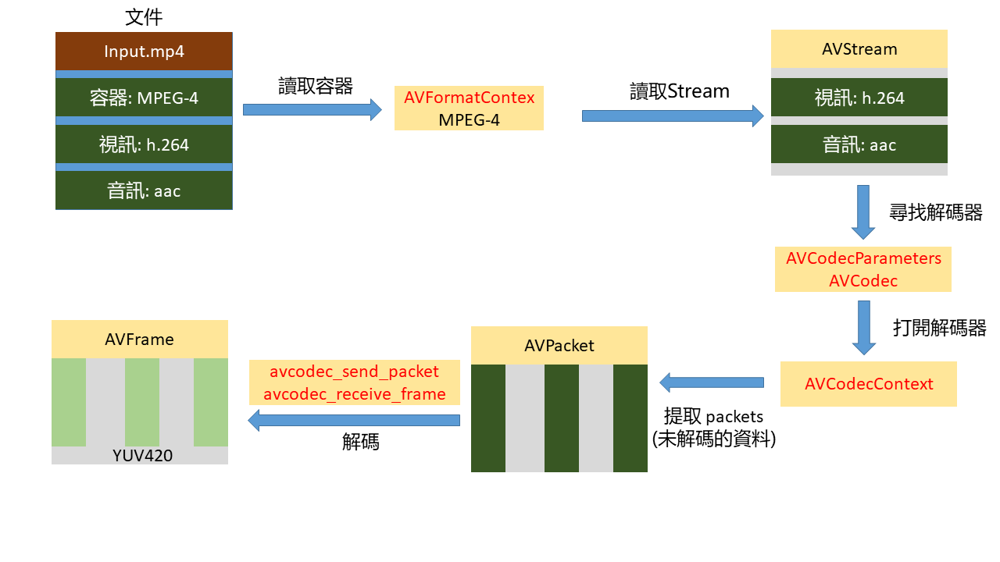
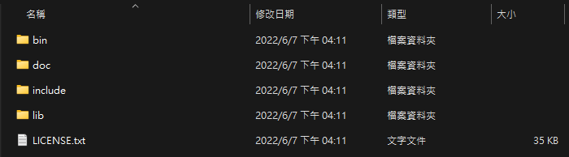
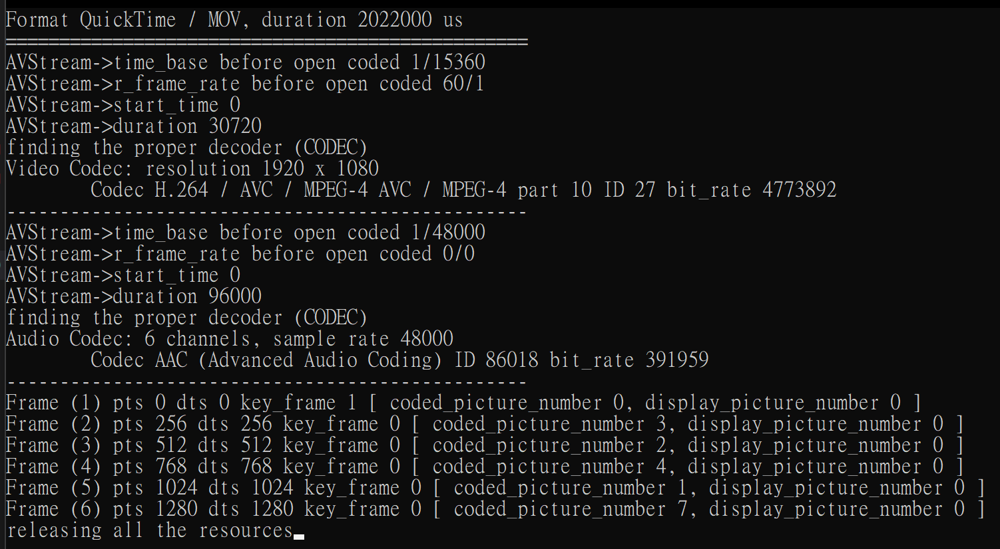
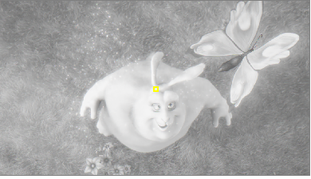
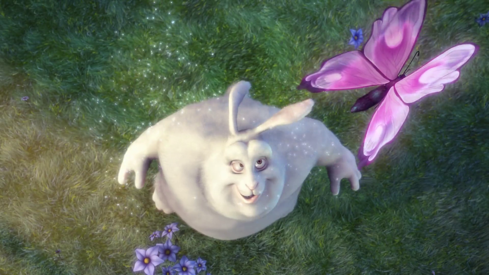
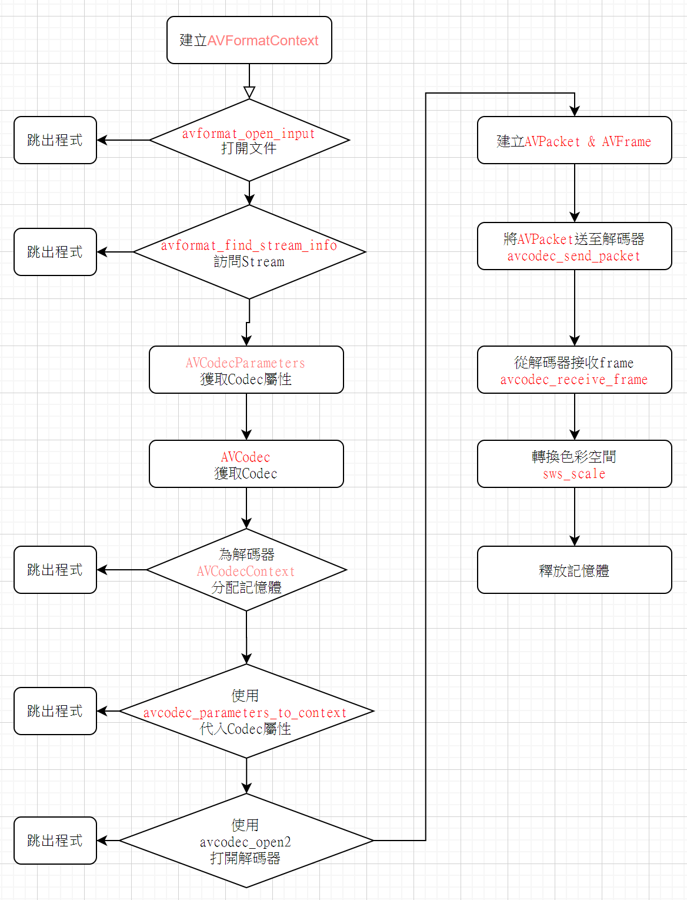
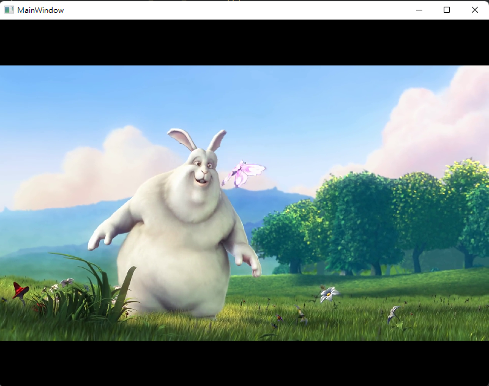

# FFMPEG Beginner

- See the [Introduction](background.md)

## FFmpeg libav architecture

Here's a diagram of the process of decoding a video:<p>



1. 加載文件 (AVFormatContext): <br>
  首先加載多媒體文件至[AVFormatContext](https://ffmpeg.org/doxygen/trunk/structAVFormatContext.html) (為便於理解，容器當作是文件格式即可)

2. 訪問數據流(AVStream): streams 可視為最基本的視訊和音訊資料, Each stream will be available in a component called [AVStream](https://ffmpeg.org/doxygen/trunk/structAVStream.html).

3. 可以從每個AVStream中尋找解碼器

4. 假設文件中包含AAC音訊流與H264（AVC）視訊流。我們可以從從每個流中提取出"pieces (slices) of data" called packets，這些packets將被加载到 AVPacket 中。

5. packets需要被解碼，we need to pass them to a specific [AVCodec](https://ffmpeg.org/doxygen/trunk/structAVCodec.html), **AVCodec** will decode them into [AVFrame](https://ffmpeg.org/doxygen/trunk/structAVFrame.html). Finally, this component gives us the **uncompressed frame**. 

## Install FFmpeg libav

- Download [ffmpeg-master-latest-win64-lgpl-shared.zip](https://github.com/BtbN/FFmpeg-Builds/releases/download/latest/ffmpeg-master-latest-win64-lgpl-shared.zip), or check the others version: https://github.com/BtbN/FFmpeg-Builds/releases

- Unzip the zip file, rename the folder as **ffmpeg** (不是必要，只是便於閱讀), check the subfolder as the following:

  

## Quick start FFmpeg libav with QT

- Create a new Qt project, and figure out the path of FFmpeg libav

  ```make
  INCLUDEPATH += $$FFMPEG_PATH/ffmpeg/include
  LIBS += -L$$FFMPEG_PATH/ffmpeg/lib -lavutil -lavformat -lavcodec -lavdevice -lavfilter -lpostproc -lswresample -lswscale
  ```

- Include the headers in your code<br>
  FFmpeg libav 為純C函式庫，為使C++相容，需加入 extern "C"語法
  
  ```c++
  extern "C"{
  #include "libavutil/avutil.h"
  #include "libavformat/avformat.h"
  #include "libavcodec/avcodec.h"
  #include "libavdevice/avdevice.h"
  #include "libavfilter/avfilter.h"
  #include "libswresample/swresample.h"
  #include "libswscale/swscale.h"
  }
  ```

## Beginner Samples

- 01-version: 顯示FFmpeg lib 版本號

- 02-AVformatContext: 加載多媒體文件至AVFormatContext

- 03-AVStream: 訪問數據流(AVStream)

- 04-AVStreamProperty: 讀取AVStream的codec屬性(AVCodecParameters)，编解码方式(AVCodec)

- 05-getAVCodec: 讀取AVCodecContext，用以維護編解碼過程

- 06-AVPacket: 從stream讀取packet

- 07-AVFrame: 從解碼器接收 raw data frame（解壓後的frame）

- 08-AVFrame_2: 將07中的解碼(讀取frame)過程以function呈現

- 09-grayFrame: 將frame轉成灰度圖像

  
  
  <p>
  
  

- 10-saveFigure: 使用sws_scale，將Frame轉成RGB，並儲存圖像

  

  <p>程式流程圖可用下圖表示<p>

  

- 11-smplePlayer: 將**10-saveFigure**放入QThread，結合QPainter播放影像

  


### Reference

- https://github.com/leandromoreira/ffmpeg-libav-tutorial#transmuxing


